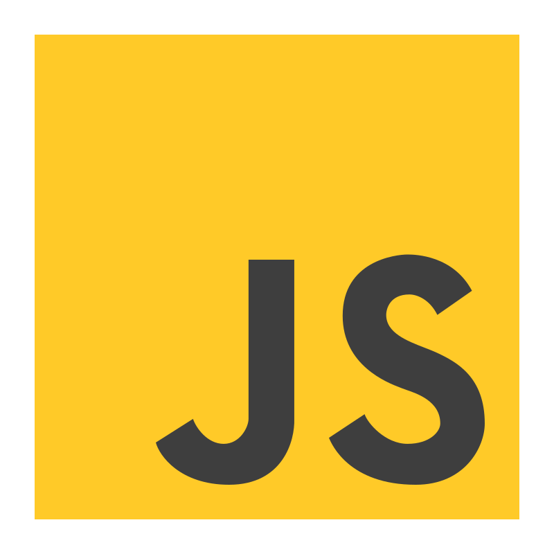

# Hello, I am Daniel Gonzalez

## About Me

I am a Mexican 🇲🇽 Software Developer 💾 with over 10 years experience.

- Frontend Developer 💻
- Backend Developer ⚙️
- Mobile Developer 📱

## Stack

   

 

 

## Certificates

<section>
  
</section>
